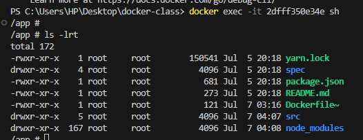

frist creat a folder and save `day02`

# How To  Dockerize a sample appllcation project

#### Clone a sammple to-do app

 (docker/getting-started.git){https://github.com/docker/getting-started-app.git}

- enter the repo you clone `getting-started-app`and write a `Dockerfile`

`Dockerfile`

~~~bash
FROM node:18-alpine

WORKDIR /app

COPY . .

RUN yarn install --production

CMD [*node*,  *src/index.js*]

EXPOSE 3000
~~~

- build the image using `docker build` 
~~~
docker build -t day02-todo .
~~~

view the image with 
~~~
docker images
~~~

- we have to push the image to the image repostory 
- login to your Docker and create a new repository `probaxia/todorepo`

- tag and push to your doker hub repo
~~~
docker tag day02-todo:latest probaxia/todorepo:latest
~~~

~~~
docker push probaxia/todorepo:latest
~~~

- pull the image from docker hub and run it on your terminal 

~~~
docker pull probaxia/todorepo:latest
~~~

~~~
docker run -dp 3000:3000 probaxia/todorepo:latest
~~~

- view your running container 
~~~
docker ps
~~~ 

- to access your application 

~~~
http://localhost:3000/
~~~

- To troubleshoot you docker container 

~~~
docker exec -it container_ID bash

~~~

- by defalt you will enter your container  root `/app`

- get out from your root container

~~~
exit 
~~~

